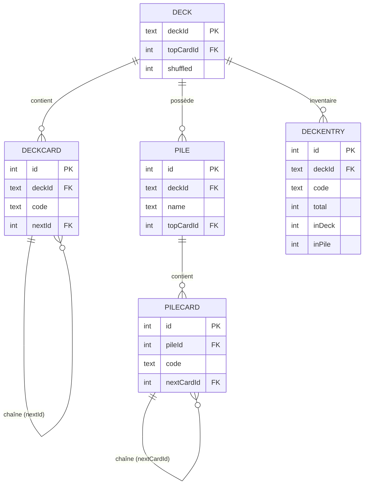

ARCHITECTURE.md - Conception du Système de Deck de Cartes
Contexte et Objectifs

Besoins fonctionnels :

    Créer un deck unique identifié par UUID
    Tirer des cartes aléatoirement (mélange)
    Distribuer les cartes en piles nommées (mains joueurs, discard, etc.)
    Consulter l'état du deck et des piles en temps réel
    Supporter plusieurs decks simultanés et indépendants

Besoins non-fonctionnels :
    Support de la concurrence (plusieurs tirages simultanés)

### Décisions de Design et Justifications
#### Pourquoi des LISTES CHAÎNÉES (nextId) plutot que de stocker la position ?

Des listes chainées sont utilisées pour garder les positions des cartes relatives dans un deck ou une pile.
Un cache(DeckEntry) de toutes les cartes uniques differentes est gardé dans une table séparée avec le nombre de cartes
de leur type dans le deck, pigées et dans les piles, afin de tracker les positions des cartes de façon efficace lors de l'ajout de cartes au piles ou
de retour de cartes dans le Deck. La seule opération nécessitant de mettre à jour toutes les positions est le shuffle, les autres piges ne nécessitent que de mettre a jour 1 ou 2 "pointeurs".

* Aspect	Liste Chaînée	Colonne position
* Tirage	O(1) : suivre topCardId → nextId, O(1) lorsqu'à la fin, selectionner la carte dont nextId = NULL	O(log n) : index sur position
* Mélange	Réassigner nextId une fois	UPDATE MASSIVE (52 lignes)
* Suppression	Repointage local O(1)	Réorganiser toutes les positions
* Flexibilité	ordonnance relative des cartes
* Espace	4 bytes (INT nextId) vs	4 bytes (INT position)

